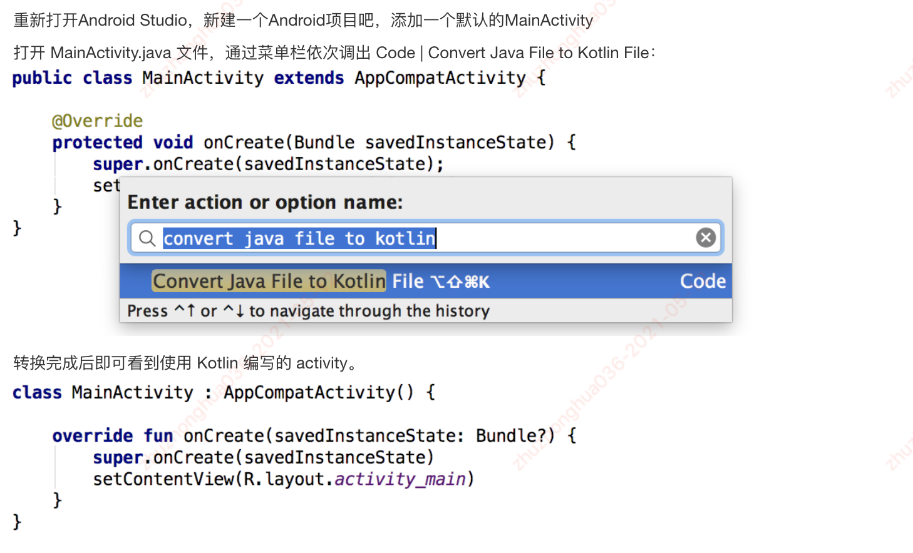

### Kotlin

#### 1.在AndroidStudio中使用kitlin

- Kotlin Android环境搭建
  - 安装kotlin插件
  - 创建新工程，选择使用kotlin作为支持语言

##### 1.1.老的项目使用kotlin语言进行开发

- 将.java文件转换成.kt语言
  - 使用as转换工具：Code / Convert Java to Kotlin

##### 1.2.Android工程支持kotlin语言，需要添加依赖

- 工程的.gradle文件添加kotlin语言以来引用

~~~kotlin
buildscript {
    ext.kotlin_version = "1.3.72"
    repositories {
        google()
        jcenter()
    }
    dependencies {
        classpath "com.android.tools.build:gradle:4.0.0"
        classpath "org.jetbrains.kotlin:kotlin-gradle-plugin:$kotlin_version"
    }
}
~~~

- App module目录下的gradle添加kotlin插件和api依赖

~~~groovy
apply plugin: 'com.android.application'
apply plugin: 'kotlin-android'
apply plugin: 'kotlin-android-extensions'

android {
    ...
}

dependencies {
    implementation fileTree(dir: "libs", include: ["*.jar"])
    implementation "org.jetbrains.kotlin:kotlin-stdlib:$kotlin_version"
    ...
}
~~~

#### 2.运行第一个kotlin程序

- 打印

~~~kotlin
fun main(args:Array<String>){
    println("hello kotlin -----")
}

hello kotlin -----
~~~

- 创建一个类，并调用类方法

~~~kotlin
fun main(args:Array<String>){
    println("hello kotlin -----")
    KotlinTest("timmy 1112").greet()
}

/**
 * 定义一个类和方法
 */
class KotlinTest(val name:String) {
    fun greet(){
        println("hello , $name")
    }
}

hello kotlin -----
hello , timmy 1112
~~~

#### 总结：

1. 使用as创建kotlin语言支持的Android项目

2. kotlin第一个程序运行，并进行打印输出 
   - println方法
3. java文件转换成kotlin文件工具